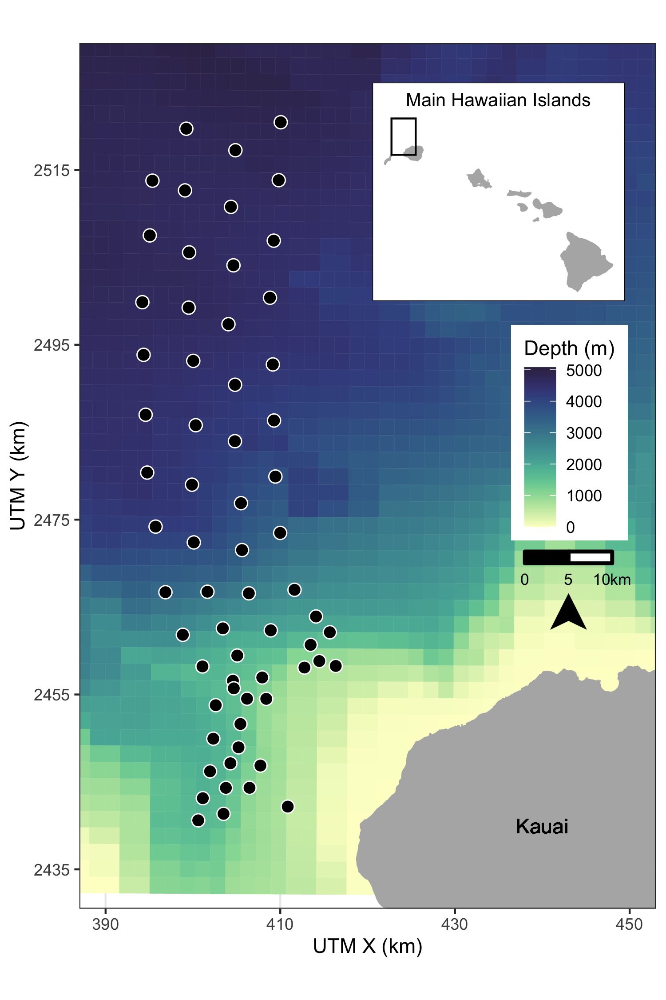

---
output:
  word_document: default
  html_document: default
  pdf_document: default
---
# Methods

## Data Collection and Processing

### Acoustic detection of beaked whales

The Pacific Missile Range Facility (PMRF) is an instrumented U.S. Navy range extending 70 km NW of the island of Kauai, Hawaii and encompassing 2,800 km^2^. The range includes a cabled hydrophone array (Fig. \@ref(fig:map)) with hydrophones at depths ranging from approximately 650 m to 4,700 m. We used data collected before and during six Submarine Command Courses (SCCs) at PMRF. SCCs are training exercises that occur biannually in February and August and typically last 6-7 days. Acoustic recordings were made for a minimum of two days before each SCC as well as during the exercise. During data collection, hydrophones sampled at a rate of 96 kHz. Up to 62 hydrophones were recorded simultaneously by the Naval Information Warfare Center (NIWC).

A beaked whale detector from the Navy Acoustic Range WHale AnaLysis (NARWHAL) algorithm suite [@martin_fy18_2020] was run on the recordings. This detector first compared signal-to-noise ratio (SNR) thresholds within the expected frequency range of beaked whale clicks (16-44 kHz) versus the bandwidth outside the click in a running 16,384-pt fast Fourier transform (FFT) spectrogram. The detected clicks were then passed to a 64-pt FFT stage that measured power, bandwidth, slope, and duration characteristics to classify the clicks to species. This process was followed by an automated routine in MATLAB [@MATLAB:2019] to group detections of individual beaked whale echolocation clicks into GVPs [@henderson_occurrence_2016]. If a group of whales was detected by more than one hydrophone, the GVP was assigned to the hydrophone that recorded the most clicks. The data were then aggregated to indicate the presence or absence of the start of a GVP for each hydrophone within each half-hour period. We used half-hour periods to approximate the typical vocal period of Blainville's beaked whales during deep foraging dives [@tyack_extreme_2006].

```{r map, fig.cap="Map of hydrophones (black points) at the Pacific Missile Range Facility near the island of Kauai, Hawaii. For security reasons, the approximate rather than exact locations are shown here. Color scale indicates bathymetry. Inset map shows range location (black rectangle) relative to the main Hawaiian Islands.", out.width = '50%', fig.align='center'}

```

### Modelling received levels of hull-mounted mid-frequency active sonar

For security reasons, classified data regarding activity that occurred on the range during each SCC was passed from PMRF to one author with clearance (E.E.H.). These data indicated the locations of the ships during the training periods and the start and stop times of each individual training event. However, no information was provided on the start and stop of sonar use; hence, periods of active sonar were determined from the range hydrophone recordings by running a sonar detector from the NARWHAL algorithm suite tuned to MFAS. 

The hydrophone recordings cannot reliably be used to determine received level when the received level exceeds 140\ dB\ re\ 1\ $\mu$Pa due to voltage constraints at the analog to digital recorder interface. Additionally, the hydrophones are mostly 4-5\ km deep, whereas Blainville's beaked whales begin clicking when they have reached depths of approximately 200-500\ m and spend most of their foraging dive at depths of 1-1.5\ km [@johnson_beaked_2004; @johnson_foraging_2006; @madsen_echolocation_2013]. Therefore, we used an acoustic modeling approach to estimate the maximum received level of hull-mounted MFAS during each half-hour period around the location of each hydrophone at a depth of 1,000\ m.

First, the locations of all surface ships were noted at the start of each half-hour period and the closest ship to each hydrophone was determined. MFAS propagation was modelled using the parabolic equation propagation model in the program Peregrine [OASIS, @heaney_three-dimensional_2016]. Acoustic transmission loss was estimated using a 200\ Hz band around the center frequency of the sonar (3.5\ kHz). A nominal source level of 235\ dB\ re\ 1\ $\mu$Pa\ @\ 1\ m was assumed [@us_department_of_the_navy_final_2018]. The transmission loss was estimated along the radial from the ship to the hydrophone from a distance of 1 km before the hydrophone to 1 km past the hydrophone in 200\ m increments and converted to received levels based on the source level of the sonar. The maximum modeled received level along that radial was determined for each hydrophone and half-hour period. However, if the distance between the ship and the hydrophone was less than the depth of the water column, the parabolic equation would overestimate transmission loss at that angle. In these cases, a simple sonar equation was used to estimate transmission loss instead [@urick_principles_1983]. For hydrophones shallower than 1,000\ m the received level was estimated at a point 20\ m above the sea floor with a +/- 10\ m buffer, while for hydrophones deeper than 1,000\ m the received level was estimated at a depth of 1,000\ m with a +/- 10 m buffer. This process resulted in an estimate of received level for each hydrophone and half-hour period. Uncertainty in the modeled received levels was not considered.

## Spatial Modelling

#### Summary {-}  
\
We first used tessellation to determine the area effectively monitored by each hydrophone. Then, we used a three-stage GAM approach to control for the underlying spatial distribution of Blainville's beaked whales when modelling the effects of training activities and of MFAS. For the first model (\texttt{M1}), we used pre-activity data to create a spatial model of the probability of GVPs across the range prior to the onset of naval activity. We used the predicted values from this first model as an offset in a second model (\texttt{M2}) created using data from when naval activity was present on the range, but MFAS was not. We then used the predicted values from this second model as an offset in a third model (\texttt{M3}) created using data when naval activity and MFAS were present on the range. Finally, we used posterior simulation to calculate confidence intervals and quantified the change in the probability of detecting GVPs when naval activity was present and across received levels of MFAS. Analyses were undertaken in \textsf{R} [@r_core_team_r_2018-1]. Code and data are available at [CITE zenodo repo].

### Determining hydrophone effort

For security reasons, randomly jittered locations and depths of hydrophones at PMRF were used. We projected the coordinates of each hydrophone into Universal Transverse Mercator Zone 4. Because the beaked whale detection algorithm assigned GVPs to the hydrophone that recorded the most echolocation clicks, and because the spatial separation of the hydrophones was not uniform, effort was not the same for all hydrophones. This meant that some hydrophones may have detected more GVPs because they were further away from other hydrophones, not because they were located in higher-density areas. To account for this, we used a Voronoi tessellation implemented in the \textsf{R} package \texttt{deldir} [@turner_deldir:_2019] to define a tile for each hydrophone that contained all points on the range that were closest to that hydrophone. We assumed that beaked whale groups occur within the tessellation tile of the hydrophone to which the GVP is assigned, and that the area of each tessellation tile influences the GVP detection rate at that hydrophone. For hydrophones on the outside of the range, i.e., not surrounded by other hydrophones, we used a cutoff radius of 7\ km to bound the tessellation tiles. This distance was based on the estimated maximum detection distance of individual Blainville's beaked whale clicks at a U.S. Naval range in the Bahamas [@marques_estimating_2009]. Different combinations of hydrophones were used during different SCCs, so separate tessellations were created for each SCC.

### M1: Modelling the pre-activity probability of dive detection

In the first model, we used data collected prior to SCCs, when no naval ships were present on the range and no other naval activity was known to occur, to model the spatial distribution of GVP detections across the range. Because of the way that GVPs were assigned to hydrophones (see Section 2.1.1) the data were not continuous in space. To account for this, we used a Markov random field (MRF) implemented in the \textsf{R} package \texttt{mgcv} [@wood_generalized_2017-1] to model the spatial distribution of GVP detections. Markov random fields [@rue_gaussian_2005] model correlation in space between discrete spatial units (henceforth, "tiles"). The correlation between two tiles is dictated by distance, as measured by the number of other tiles one needs pass through to travel between two tiles ("hops"); correlation is strongest between a tile and its direct neighbors (those tiles it shares a border with) and decreases with additional hops. This was appropriate for our data as we did not know where in each tile a given GVP occurred, but we assumed that it did occur in that tile.

We modelled the probability of a GVP at tile $i$ during SCC $s$ ($\mu_{\texttt{M1},i,s}$) as a Bernoulli random variable. The linear predictor (on the logit scale) was given as:

\begin{equation*}
    \text{logit}\left(\mu_{\texttt{M1},i,s}\right) = \beta_{\texttt{M1},0} +  f(\texttt{MRF}_{i,s}) + f(\texttt{Depth}_i) + \log_e A_{i,s} \qquad (1)
\end{equation*}

where $\beta_{\texttt{M1},0}$ is an intercept, $f(\texttt{MRF}_{i,s})$ denotes the Markov random field used to smooth space in the $s^\text{th}$ SCC, $f(\texttt{Depth}_i)$ is a smooth of depth at the location of each hydrophone (using a thin plate spline; @wood_thin_2003) and $\log_e A_{i,s}$ is an offset for the area (in $\text{km}^2$) of each tile for each SCC, $A_{i,s}$. The offset term accounts for changes in probabilities of GVP detection due to the different areas monitored by each hydrophone. Because the hydrophone tessellation changed between SCCs (as there were different sets of hydrophones recorded during each SSC), separate MRFs were used for each SCC, but a single smoothing parameter was estimated across all MRFs. This allowed for different spatial smooths for each SCC, but constrained the smooths to have the same amount of wiggliness. The smooth of depth was shared across SCCs. We used this model to predict the baseline probability of a GVP detection at each hydrophone.

### M2: Modelling the effect of Naval activity

For the second model, we used data collected prior to the onset of hull-mounted MFAS used during SCCs, when other naval training activities occurred at PMRF. Various vessels were present on the range during these periods, and other noise sources, including range-tracking pingers, torpedoes, and submarines, may have been present. We used data collected when training activity was present on the range, but hull-mounted MFAS was not used, to model the effect of general naval activity on beaked whale GVPs. 

We used the predicted baseline probability of a GVP detection at each hydrophone from \texttt{M1} as an offset to control for the underlying spatial distribution of GVPs. The model for the data when naval activity was present was intercept-only, with an offset derived from \texttt{M1}. This meant that the spatial distribution of GVPs was not allowed to change, but that we expected a uniform relative change in GVPs when naval activity was present. We again modelled the probability of GVP presence at tile $i$ ($\mu_{\texttt{M2},i}$) as a Bernoulli random variable, with the following linear predictor:

\begin{equation*}
    \text{logit}\left(\mu_{\texttt{M2},i,s}\right) = \beta_{\texttt{M2},0} + \log_e \xi_{\texttt{M1}, i,s}, \qquad (2)
\end{equation*}

where $\beta_{\texttt{M2},0}$ is an intercept and $\xi_{\texttt{M1}, i,s}$ is the prediction (on the $\text{logit}$ scale) for tile $i$ during SCC $s$ using model $\texttt{M1}$, included as an offset term.

### M3: Modelling the effect of hull-mounted MFAS

For the third model, we used data collected when hull-mounted MFAS was present on the range to model the effect of sonar on beaked whales. We excluded data collected during breaks in training activities when sonar was not being used. The probability of a GVP when sonar was present was modeled as a function of the maximum received level (modeled at each hydrophone for each half-hour period; see section 2.2.1). We assumed that as the maximum received level increased, the probability of dives decreased and modeled this using a monotonically decreasing smooth implemented in the \textsf{R} package \texttt{scam} [@pya_shape_2015]. To ensure that the model predictions were the same at a maximum received level of 0\ dB and when ships were not present, we did not include an intercept. Probability of GVP presence at tile $i$ ($\mu_{\texttt{M3},i}$) was modelled as a Bernoulli random variable where the linear predictor was:

\begin{equation*}
    \text{logit}\left(\mu_{\texttt{M3},i,s}\right) = f(\texttt{MaxRL}_{i,s}) + \log_e \xi_{\texttt{M2}, i,s}, \qquad (3)
\end{equation*}

where $f(\texttt{MaxRL}_{i,s})$ was modeled as a monotonic decreasing smooth, $\xi_{\texttt{M2}, {i,s}}$ denotes the prediction (on the $\text{logit}$ scale) for tile $i$ during SCC $s$ when naval training activities were present on the range using model $\texttt{M2}$.

### Uncertainty propagation

We used posterior simulation [sometimes referred to as a parametric bootstrap, @wood_generalized_2017] to propagate uncertainty through M1, M2, and M3. This consisted of sampling from the posterior distribution of the parameters for each model in turn, calculating predictions using these parameters and then refitting the subsequent model with updated offsets. We generated 5,000 sets of posterior samples. Following this procedure through from M1 to M2 to M3 incorporated uncertainty from each model in the final predictions of the probability of detecting a GVP given different combinations of covariates.

The prediction grid contained all possible combinations of covariates within the realized covariate space; i.e., each hydrophone for each SCC with associated location, hydrophone depth, and area of the tessellation tile, presence/absence of naval activity, and, if naval activity was present, then either sonar absence or sonar received level. Based on the resulting final posterior distribution of results (for model M3) we used 2.5\%, 50\%, and 97.5\% quantiles to obtain median predictions and credible intervals (CIs). Mathematical details of the procedure are given in Appendix S1.

### Quantifying the change in probability of GVPs

Finally, we calculated the expected change in the probability of detecting a GVP at each hydrophone $P(\text{GVP})$ relative to either the probability of detecting a GVP when no general naval training activity was present and no MFAS was present ($\Delta_{\texttt{M3:M1}}$), or relative to probability of detecting a GVP when general naval training activity was present but no MFAS was present ($\Delta_{\texttt{M3:M2}}$) with uncertainty.

Using the $N_b$ posterior samples, we calculated the expected $P(\text{GVP})$ under each set of covariates as
\begin{equation}
P(\text{GVP}) = \text{logit}^{-1} (\mu_{\texttt{M}} ),
\end{equation}
for each $\texttt{M} = \texttt{M1}$, $\texttt{M2}$, and $\texttt{M3}$. Then, we calculated the change in $P(\text{GVP})$ for each set of covariates between $\texttt{M3}$ and $\texttt{M1}$ ($\Delta_{\texttt{M3:M1}}$) and between $\texttt{M3}$ and $\texttt{M2}$ ($\Delta_{\texttt{M3:M2}}$) for each realization of the posterior simulation. 
\begin{align}
\Delta_{M3:M1} &= \frac{P(\text{GVP})_{\texttt{M3}} -  P(\text{GVP})_{\texttt{M1}}}{P(\text{GVP})_{\texttt{M1}}}\\
\Delta_{M3:M2} &= \frac{P(\text{GVP})_{\texttt{M3}} -  P(\text{GVP})_{\texttt{M2}}}{P(\text{GVP})_{\texttt{M2}}}
\end{align}
For each received level we calcualted the 2.5th, 50th, and 97.5th quantiles of $\Delta_{\texttt{M3:M1}}$ and $\Delta_{\texttt{M3:M2}}$ to create 95\% CIs of change in $P(\text{GVP})$ across possible received levels. 


