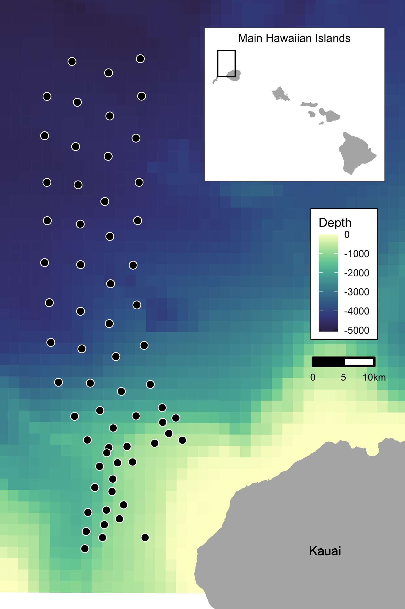

---
output:
  pdf_document: default
  html_document: default
---
# 2 Methods

## 2.1 Data Collection and Processing

### 2.1.1 Acoustic detection of beaked whales

The Pacific Missile Range Facility (PMRF) is an instrumented U.S. Naval range extending 70 km NW of the island of Kauai, Hawaii and encompassing 2,800 km^2^.  The range includes a cabled hydrophone array (Fig. 1) with hydrophones at depths ranging from approximately 650 m to 4,700 m. We used data collected before and during six Submarine Command Courses (SCCs) at PMRF. SCCs are training exercises that occur biannually in February and August and typically last 6-7 days.  The period before the onset of the SCC is recorded for a minimum of 2 days.  During data collection, hydrophones sampled at a rate of 96 kHz, with the high pass filter on each phone set at either 50 Hz, 100 Hz, or 10 kHz.  Up to 62 of the range hydrophones were recorded simultaneously by the Naval Information Warfare Center (NIWC).  

A beaked whale detector from the Navy Acoustic Range WHale AnaLysis (NARWHAL) algorithm suite [CITE] was run on recordings from PMRF.  This detector first compares signal-to-noise (SNR) thresholds within the expected beaked whale click frequency range (16 - 44 kHz) versus the bandwidth outside the click in a running 16384-pt fast Fourier transform (FFT) spectrogram. The detected clicks were then passed to a 64-pt FFT stage that measured power, bandwidth, slope, and duration characteristics to classify the clicks to species. This process was followed by an automated routine in Matlab (CITE Mathworks 2019) to group detections of individual beaked whale echolocation clicks into GVPs (CITE). If a group of whales was detected by more than one hydrophone, the GVP was assigned to the hydrophone that recorded the most clicks. The data were then aggregated to indicate the presence or absence of the start of a GVP for each hydrophone within each half-hour period. 

```{r fig1, fig.cap="Map of approximate locations of hydrophones (black points) at the Pacific Missile Range Facility near the island of Kauai, Hawaii.  Color scale indicates bathymetry. Inset map shows range location relative to the Main Hawaiian Islands.", out.width = '50%', fig.align='center'}

```

### 2.1.2 Modelling received levels of hull-mounted mid-frequency active sonar

Classified ship positional data and other activity that occured on the range during each SCC were provided by PMRF. These data indicated the locations of the ships during the training periods and the start and stop times of each individual training event, but no information was provided on the start and stop of sonar use. Periods of active sonar were determined by running a sonar detector from the NARWHAL algorithm suite tuned to MFAS. The locations of all surface ships were noted for each half-hour period and the closest ship to each hydrophone was determined. Propagation modelling was used to calculate the expected received level of hull-mounted mid-frequency active sonar at the location of each hydrophone from the closest ship during each half-hour period of each SCC. 

The propagation modelling was done using the parabolic equation propagation model in the program Peregrine (OASIS; Heaney and Campbell, 2016) to estimate the transmission loss between the ship and the hydrophone; this was then converted to a received level at the hydrophone location based on the source level of the sonar. However, if the distance between the ship and the hydrophone was less than the depth of the water column, the parabolic equation overestimates transmission loss at that angle and so a simple sonar equation was used to estimate transmission loss instead. Transmission loss was estimated using a 200 Hz band around the center frequency of the sonar type (here, 3.5 kHz). Transmission loss was estimated at depth since Blainville’s beaked whales don’t begin clicking until they have reached approximately XX m depth of their foraging dive and spend most of their foraging dive at around 1000 m (CITE). 

For hydrophones shallower than 1000 m the received level was estimated at a point 20 m above the sea floor with a +/- 10 m buffer, while for hydrophones deeper than 1000 m the received level was estimated at a depth of 1000 m with a +/- 10 m buffer. The location of the beaked whale foraging group was assumed to be within 4-6 km of the hydrophone with the most click detections, since beaked whale echolocation clicks attenuate beyond that distance [@mccarthy_changes_2011; @marques_estimating_2009]. Therefore the transmission loss was estimated along the radial from the ship to the hydrophone from a distance of 1 km before the hydrophone to 1 km past the hydrophone in 200 m increments. The maximum modeled received level along that radial was determined for each hydrophone and half-hour period and aggregated with the data on beaked whale group detections. Uncertainty in the modeled received level was not considered.

## 2.2 Spatial Modelling

We used a multi-stage generalized additive modelling (GAM) approach to control for the underlying spatial distribution of Blainville's beaked whales when modelling the effects of training activities and of MFA sonar.  We first used a tessellation to determine the area effectively monitored by each hydrophone.  Then, we used pre-activity data to create a spatial model of the probability of GVPs across the range prior to the onset of naval activity.  We used the predicted values from this model as an offset in a model created using data from when naval activity was present on the range, but MFAS was not.  Again, we used the predicted values from this model as an offset in a model created using data when naval activity and MFAS were present on the range.  Finally, we used posterior simulation to calculate confidence intervals and quantified the change in the probability of detecting GVPs when Naval activity was present and across received levels of MFAS.

### 2.3.1 Determining hydrophone effort

For security reasons, randomly jittered locations and depths of hydrophones at PMRF were used.  We projected the coordinates of each hydrophone into Universal Transverse Mercator Zone 4. 

Because the beaked whale detection algorithm assigned groups of whales to the hydrophone that recorded the most echolocation clicks, and because the spatial separation of the hydrophones was not uniform, effort was not the same for all hydrophones.  To determine the area effectively monitored by each hydrophone, we used a Voronoi tessellation implemented in the \textsf{R} [@r_core_team_r_2018-1] package \texttt{deldir} [@turner_deldir_2019] to define a tile for each hydrophone that contained all points on the range that were closest to that hydrophone.  The area of each tile corresponded to the effective area monitored.  We assumed that beaked whale groups occur within the tessellation tile of the hydrophone to which the GVP is assigned.  For hydrophones on the outside of the range, i.e., not surrounded by other hydrophones, we used a cutoff radius of 6500 m to bound the tessellation tile.  This distance is based on the maximum detection distance of individual Blainville's beaked whale clicks at a U.S. Naval range in the Bahamas [@marques_estimating_2009]. Different combinations of hydrophones were used during different SCCs, so separate tessellations were created for each SCC.

### 2.3.2 M1: Modelling the pre-activity probability of dive detection

We used data collected prior to SCCs, when no Naval ships were present on the range and no other Naval activity was known to occur, to model the spatial distribution of GVP detections across the range.  The exact locations of beaked whale groups was not known; rather, detections of beaked whale groups were "snapped" to hydrophone locations depending on which hydrophone detected the most echolocation clicks.  Therefore, the data were not continuous in space.  To account for this, we used a Markov random field to model the spatial distribution of GVP detections.  A Markov random field [@rue_gaussian_2005] is a method for modelling correlation in space between discrete spatial units. Each unit is correlated more strongly with its neighbours (those units which touch) than those that are more hops away. This gives a graph structure, where distance between tiles is measured as the number of hops required. This is appropriate for our data as we did not know where in each tile a given GVP occured, but we assumed that it did occur in that tile.

The R package \texttt{mgcv} [@wood_generalized_2017-1] was used to formulate the model on the tessellation described in the previous section. The linear predictor for the model was:
\begin{equation*}
    \text{logit}\left(\mu_{\texttt{M1},i}\right) = \beta_{\texttt{M1},0} +  f(\texttt{MRF}_i) + f(\texttt{Depth}_i) + \log_e A_i, \qquad (\texttt{M1})
\end{equation*}
where $\texttt{DivePresent}_i \sim \text{Bin}(1, _{\texttt{M1},i})$. The spatial smooth MRF is given by $f(\texttt{MRF}_i)$, $f(\texttt{Depth}_i)$ is a smooth of depth (using a thin plate spline; @wood_thin_2003) and $\log_e A_i$ is an offset for the area (in $\text{km}^2$) of each tile, $A_i$. The offset term accounts changes in probabilities of GVP detection due to the differing area monitored by each hydrophone.  Because the hydrophone tessellation change between SCCs, separate MRFs were used for each SCC, but a single smoothing parameter was estimated across all MRFs. Therefore different spatial patterns could occur, but with the same amount of variation. The smooth of depth was shared across SCCs.

NOTE: f(MRF) could be indexed by SCC to indicate that the smooth function is different for each.

### 2.3.3 M2: Modelling the effect of Naval activity

For a few days prior to the onset of hull-mounted MFA sonar used during SCCs, other Naval training activities occurred at the PMRF.  Various vessels were present on the range during this period and other noise sources, including torpedoes and submarines, may have been present.  We used data collected when training activity was present on the range, but hull-mounted MFA sonar was not used, to model the effect of general Naval activity on beaked whale GVPs.  Initially, we tried to use low-frequency noise levels in the 10-999 Hz range measured on range hydrophones as a covariate in this model, but found that the measured noise levels were not consistent with known locations of Naval training activities (see Appendix B for details).  

We used the predicted baseline probability of a GVP detection from Model 1 as an offset to control for the underlying spatial distribution of GVPs.  The model for the data when ships were present was intercept-only, with an offset derived from \texttt{M1}. This model was simply:
\begin{equation*}
    \text{logit}\left(\mu_{\texttt{M2},i}\right) = \beta_{\texttt{M2},0} + \log_e \xi_{\texttt{M1}, i}, \qquad (\texttt{M2})
\end{equation*}
where $\texttt{DivePresent}_i \sim \text{Bin}(1, \mu_{\texttt{M2},i})$. $\xi_{\texttt{M1}, i}$ denotes the prediction (on the $\text{logit}$ scale) for tile $i$ using model $\texttt{M1}$. This was again modeled in the R package \texttt{mgcv}.

### 2.3.4 M3: Modelling the effect of hull-mounted MFA sonar

We used data collected when hull-mounted MFA sonar was present on the range to model the effect of sonar on beaked whales. The probability of a dive when sonar was present was modeled as a function of the maximum received level (modeled at each hydrophone; see section 2.2). We assumed that as the maximum received level increased, the probability of dives decreased and modeled this using a shape constrained smooth so that the relationship held for all possible realizations of the smooth. To ensure that the model predictions were the same at a maximum received level of 0 dB and when ships were not present, we did not include an intercept. This model was written as:
\begin{equation*}
    \text{logit}\left(\mu_{\texttt{M3},i}\right) = f(\texttt{MaxRL}_i) + \log_e \xi_{\texttt{M2}, i}, \qquad (\texttt{M3})
\end{equation*}
where $\texttt{DivePresent}_i \sim \text{Bin}(1, \mu_{\texttt{M3},i})$. $f(\texttt{MaxRL}_i)$ was modeled as a monotonic decreasing smooth using the R package \texttt{scam} [@pya_shape_2015]. $\xi_{\texttt{M2}, i}$ denotes the prediction (on the $\text{logit}$ scale) for tile $i$ when Naval training activites were present on the range using model $\texttt{M2}$. 

### 2.3.5 Uncertainty propagation

We used posterior simulation to propagate uncertainty through M1, M2, and M3. Each model was fitted via restricted maximum likelihood (REML; @wood_fast_2008), so the results are empirical Bayes estimates. In this case we can generate samples from the (multivariate normal) posterior of the model parameters, using mvtnorm?. After generating a sample, $\boldsymbol{\beta}^* \sim \text{MVN}(\hat{\boldsymbol{\beta}}, \textbf{V}_{\boldsymbol{\beta}})$, we can use the matrix that maps the model parameters to the predictions on the linear predictor scale (often referred to as the $\mathbf{L}_p$ matrix or $\mathbf{X}_p$ matrix; @wood_generalized_2017; section 7.2.6), along with the inverse link function to generate predictions for each posterior sample. Here the $\boldsymbol{\beta}$ for each model includes the coefficients for the smooth terms in the model and fixed effects (e.g., intercept) if present. Predictions, $\boldsymbol{\mu}^*$, can be written as:
\begin{equation*}
        \boldsymbol{\mu}^* = g^{-1}(\boldsymbol{\eta}^*) = g^{-1}(\mathbf{X}_p\boldsymbol{\beta}^*+\boldsymbol{\xi}),
\end{equation*}
where $g$ is the link function, $\boldsymbol{\eta}^*$ is the linear predictor and $\boldsymbol{\xi}$ is any offset used by this prediction. By sampling from the posterior of $\hat{\boldsymbol{\beta}}$, and then taking the variance of the resulting predictions we can obtain variance estimates (@wood_generalized_2017; section 7.2.6). The prediction grid contained all possible combinations of covariates within the realized covariate space; i.e., each hydrophone for each SCC with associated location, hydrophone depth, and area of the tessellation tile, presence/absence of Naval activity, and, if Naval activity was present, then either sonar absence or sonar received level between 35 and 190 dB in intervals of 5 dB.  This procedure was repeated for each model, with refitting to updated offsets from the previous model. 

An algorithm for calculating the variance from our multi-stage approach is as follows. First define $N_b$ as the number of samples to make, let $\mathbf{X}_{p,\texttt{M}j}$ for $j=1,2,3$ be the $\mathbf{L}_p$ matrix that maps coefficients to the predictions for model $\texttt{M}j$. For $N_b$ times:
\begin{enumerate}
    \item Draw a sample from the posterior of $\texttt{M1}$:  $\tilde{\boldsymbol{\beta}}_\texttt{M1}\sim\text{MVN}(\hat{\boldsymbol{\beta}}_\texttt{M1}, \mathbf{V}_\texttt{M1})$.
    \item Calculate a new offset for $\texttt{M2}$, $\tilde{\boldsymbol{\xi}}_{\texttt{M1}} = \mathbf{X}_{p,\texttt{M1}} \tilde{\boldsymbol{\beta}}_\texttt{M1} + \log_e \mathbf{A}$.
    \item Refit $\texttt{M2}$ with $\tilde{\boldsymbol{\xi}}_{\texttt{M1}}$ as the offset, to obtain $\texttt{M2}^\prime$.
    \item Draw a sample from the posterior of $\texttt{M2}^\prime$:  $\tilde{\boldsymbol{\beta}}_{\texttt{M2}^\prime} \sim\text{MVN}(\hat{\boldsymbol{\beta}}_{\texttt{M2}^\prime}, \mathbf{V}_{\texttt{M2}^\prime})$
    \item Calculate a new offset for $\texttt{M3}$, $\tilde{\boldsymbol{\xi}}_{\texttt{M2}} = \mathbf{X}_{p,\texttt{M2}} \tilde{\boldsymbol{\beta}}_\texttt{M2}^\prime + \tilde{\boldsymbol{\xi}}_{\texttt{M1}}$ (predictions for the sonar data locations for $\texttt{M2}^\prime$).
    \item Refit $\texttt{M3}$ with offset $\tilde{\boldsymbol{\xi}}_{\texttt{M2}}$ to obtain $\texttt{M3}^\prime$.
    \item Predict $\boldsymbol{\mu}_{\texttt{M1}^\prime}$, $\boldsymbol{\mu}_{\texttt{M2}^\prime}$, and $\boldsymbol{\mu}_{\texttt{M3}^\prime}$ over prediction grid and store them.
\end{enumerate}
We can then calculate summary statistics (means and variances) of the $N_b$ values of $\boldsymbol{\mu}_{\texttt{M1}^\prime}$, $\boldsymbol{\mu}_{\texttt{M2}^\prime}$, and $\boldsymbol{\mu}_{\texttt{M3}^\prime}$ we have generated. The empirical variance of the $N_b$ values of $\boldsymbol{\mu}_{\texttt{M3}^\prime}$ will give the uncertainty, incorporating components from all three models. We can take appropriate pointwise quantiles to form confidence bands for the functional relationships between sonar received level and estimated probability of detecting GVPs.

### 2.3.6 Quantifying the change in probability of GVPs

Finally, we calculated the expected change in $\mathbb{P}(\text{GVP})$ relative to either the distribution of GVPs when no general Naval training activity was present and no MFA sonar was present ($\Delta_{M3':M1'}$), or relative to the distribution of GVPs when general Naval training activity was present but no MFA sonar was present ($\Delta_{M3':M2'}$).

Using the $N_b$ bootstrapped model realizations we calculated the expected $\mathbb{P}(\text{GVP})$ under each set of covariates as
\begin{equation}
\mathbb{P}(\text{GVP}) = \text{logit}^{-1} (\mu_{\texttt{M}^\prime} ),
\end{equation}
for each $\texttt{M1}^\prime$, $\texttt{M2}^\prime$, and $\texttt{M3}^\prime$.  Then, we calculated the change in $\mathbb{P}(\text{GVP})$ for each set of covariates $\texttt{M3}^\prime$ and $\texttt{M1}^\prime$ ($\Delta_{M3':M1'}$) and between $\texttt{M3}^\prime$ and $\texttt{M2}^\prime$ ($\Delta_{M3':M2'}$) for each realization of the posterior simulation. 
\begin{align}
\Delta_{M3':M1'} &= \frac{\mathbb{P}(\text{GVP})_{\texttt{M3}^\prime} -  \mathbb{P}(\text{GVP})_{\texttt{M1}^\prime}}{\mathbb{P}(\text{GVP})_{\texttt{M1}^\prime}}\\
\Delta_{M3':M2'} &= \frac{\mathbb{P}(\text{GVP})_{\texttt{M3}^\prime} -  \mathbb{P}(\text{GVP})_{\texttt{M2}^\prime}}{\mathbb{P}(\text{GVP})_{\texttt{M2}^\prime}}
\end{align}
For each received level we calcualted the 2.5th, 50th, and 97.5th quantiles of $\Delta_{M3':M1'}$ and $\Delta_{M3':M2'}$ to create 95\% CIs of change in $\mathbb{P}(\text{GVP})$ across possible received levels.  We consider that the probability of disturbance is equal to 1 wherever the 95\% CI does not include 0, and 0 otherwise.

### 2.3.7 Implementation

Statistical analyses presented in this manuscript were conducted in R [v. 3.5.2; @r_core_team_r_2018-1].  Data import and manipulation was accomplished using the packages \texttt{dplyr} [@wickham_dplyr_2020], \texttt{lubridate} [@grolemund_dates_2011-1], \texttt{readr} [@wickham_readr_2018], \texttt{readxl} [@wickham_readxl_2019-1], and \texttt{tidyr} [@wickham_tidyr_2020]. Map creation was facilitated by the \texttt{fields} [@douglas_nychka_fields_2017-1], \texttt{ggsn}, \texttt{marmap}, \texttt{rgdal}, \texttt{sf}, and \texttt{sp} packages.  All graphics were produced using \texttt{ggplot2}, with color palettes from the \texttt{viridis} and \texttt{cmocean} packages.  The manuscript was written in \texttt{rmarkdown} [@xie_r_2018]. 

