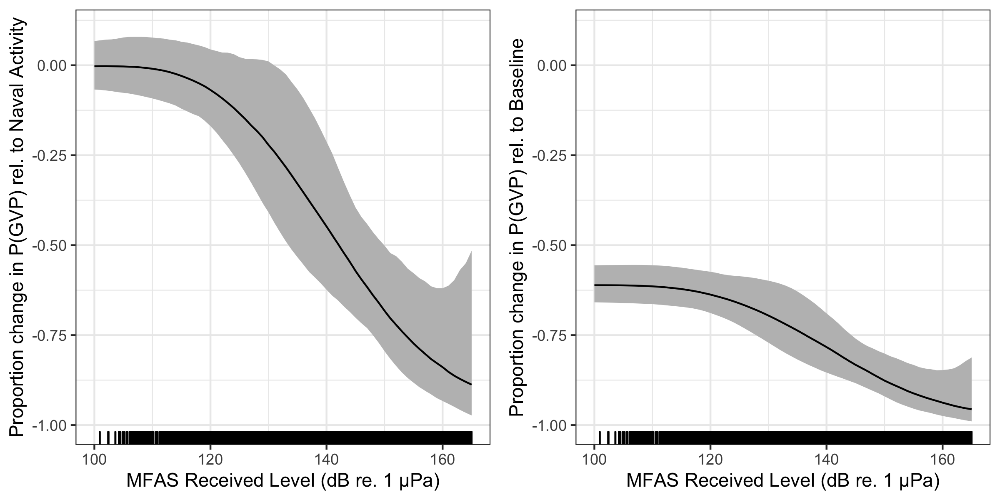

---
output:
  pdf_document: default
  html_document: default
---
# Results

## Results of Data Collection and Processing

```{r}

load("../Data/rlDataN.RData")
load("../Data/delta21summary.RData")
load("../Data/delta31summary.RData")
load("../Data/delta32summary.RData")

```

Data were collected before and during six SCCs: two each in 2013, 2014, and 2017 (Table \@ref(tab:data)). The number of hydrophones for which recordings were available for each SCC varied from 49 to 61. A total of 190,928 30-min observations were made. 

```{r data}

load("../Data/summaryTable.RData")

knitr::kable(table, caption="Number of hydrophones (HPs) used and number of observations made (no. 30-min periods) during each Submarine Commander Course (SCC) before the exercise began, when naval activity was present, and when naval activity and mid-frequency active (MFA) sonar were present.")

```

The exact timing of activities during these exercises varied (Fig. \@ref(fig:timeseries)). For most SCCs, pre-activity data were available immediately preceding the onset of Naval training activity; however, in February 2013 the only available pre-activity data were collected almost a month prior to the onset of Naval training activity. In some SCCs, weekends or other breaks in training resulted in a break in training activity on the range during the days preceding MFAS use. MFAS was used for 3-4 days during each training event. 

```{r timeseries, fig.cap="Timeseries of six recorded Naval training activities at the Pacific Missile Range Facility. The timeseries are aligned relative to the first day that mid-frequency active (MFA) sonar (red triangles) was used in each exercise (horizontal axis). Days with white background indicate days for which recordings and data were available. Dark gray bars indicate the proportion of 30-min periods on each day, across all hydrophones, when group vocal periods (GVPs) were detected (vertical axis). Black dots indicate days when Naval activity was present on the range.", out.width = '50%', fig.align='center'}
include_graphics("../Figures/Timeseries.pdf")
```

Across all SCCs, hydrophones, and conditions, a total of 2,312 GVPs were identified. The average probability of detecting a GVP during each half-hour period was therefore `r round(sum(rlData$DivePresent)/nrow(rlData), digits = 3)*100`\%. The spatial distribution of GVPs differed during the pre-activity phases of SCCs (Fig. \@ref(fig:obspdive); top panel).

Modelled maximum received levels ranged from `r round(range(sonar$MaxRL[which(sonar$MaxRL>0)])[1])` to `r round(range(sonar$MaxRL[which(sonar$MaxRL>0)])[2])` dB re. 1 $\mu$Pa, with a median value when MFAS was present of `r round(median(sonar$MaxRL[which(sonar$MaxRL>0)]))` dB re. 1 $\mu$Pa. The intensity and spatial distribution of MFAS received levels varied across the range and across SCCs (Fig. \@ref(fig:mfas)). 

```{r}
load("../Data/naiveEstReduction.RData")
```

Based on the observed data, the probability of detecting a GVP changed by `r round(naive[1]*100)`\% when general naval training activity was present compared to when naval activity was absent, by `r round(naive[2]*100)`\% when naval activity and MFAS were present compared to when only naval activity was present, and by `r round(naive[3]*100)`\% when naval activity and MFAS were present compared to when neither naval activity nor sonar were present (Fig. \@ref(fig:boxplot)). The highest modelled received level at which a GVP was observed was 164 dB re. 1 $\mu$Pa. 

## Results of spatial modelling

We created separate tessellations for each SCC (Fig. \@ref(fig:tessellations)). In August 2017, data were available from fewer hydrophones, and so in some cases the tessellated tiles, with bounding radius of 6,500 m, did not completely cover the range. Hydrophone depths varied from approximately `r round(min(rlData$Depth), digits = -1)` to `r round(max(rlData$Depth), digits = -1)` m.

\texttt{M1} fitted a spatial model of $P(\text{GVP})$ to data collected prior to the onset of naval training activity. This model used a MRF smooth to account for the spatial structure of the range and a spline on depth, with an offset for the log of the area effectively monitored by each hydrophone. Both the MRF and spline on depth were significant at the $\alpha$ = 0.05 level (\textit{p}-value < 2E-16). The model explained 14.1\% of deviance in the dataset, and visual inspection of observed versus predicted values indicated a good fit to the data (Fig. \@ref(fig:m1obspred)). The model \texttt{M1} predicted highest $P(\text{GVP})$ at hydrophone depths between 1,500 and 2,000 m (Fig. \@ref(fig:sdepth)).

\texttt{M2} used the predicted values from \texttt{M1} as an offset and fitted a model of to data when naval activity was ongoing, as indicated by the presence of naval ships on the range. This model was intercept-only, and $P(\text{GVP})$ when naval activity was ongoing was significantly different from the baseline period at the $\alpha$ = 0.05 level (\textit{p}-value < 2E-16). The expected $P(\text{GVP})$ decreased by a median of `r round(abs(d21$Q50 * 100), digits = 0)`\% (95\% CI `r round(abs(d21$Q97.5 * 100), digits = 0)`\% - `r round(abs(d21$Q2.5 * 100), digits = 0)`\%) when naval activity was present compared to when it was absent. 

\texttt{M3} used the predicted values from \texttt{M2} as an offset and fitted a model to data when naval activity and MFAS were present. This model used a monotonically decreasing spline on modelled MFAS received level (Fig. \@ref(fig:srl)) and did not include an intercept term. The smooth on MFAS received level was significant at the $\alpha$ = 0.05 level (\textit{p}-value = 6.74E-10) and the model explained 12.4\% of deviance in the data. 

We did not make inference on sonar received levels below 100\ dB\ re.\ 1\ $\mu$Pa because Blainville's beaked whales are unlikely to perceive MFAS below received levels of approximately 80 dB\ re.\ 1\ $\mu$Pa [@pacini_audiogram_2011] and because very little data (9\ hrs, or 1\% of the data collected when MFAS was present) was collected at received levels below 100\ dB\ re.\ 1\ $\mu$Pa. Similarly, we did not make inference on sonar received levels above 165\ dB\ re.\ 1\ $\mu$Pa because no GVPs were observed above this received level and therefore \texttt{M3} predicted $P(\text{GVP})$ = 0 (95\% CI 0-1).

For MFAS received levels between 100 and 165 dB\ re.\ 1\ $\mu$Pa, change in $P(\text{GVP})$ was calculated relative to the pre-activity baseline period ($\Delta_{M3:M1}$) and to the period when naval activity was present on the range 
 ($\Delta_{M3:M2}$; Fig. 4). At a received level of 150 dB, $\Delta_{M3:M1}$ was `r filter(d31, MaxRL == 150) %>% select(Q50) %>% round(digits = 2)*100`\% (95\% CI `r (filter(d31, MaxRL == 150) %>% select(Q2.5) %>% round(digits = 2))*100`\% - `r (filter(d31, MaxRL == 150) %>% select(Q97.5) %>% round(digits = 2))*100`\%) and $\Delta_{M3:M2}$ was `r (filter(d32, MaxRL == 150) %>% select(Q50) %>% round(digits = 2))*100`\% (95\% CI `r (filter(d32, MaxRL == 150) %>% select(Q2.5) %>% round(digits = 2))*100`\% - `r (filter(d32, MaxRL == 150) %>% select(Q97.5) %>% round(digits = 2))*100`\%). Relative to when only naval training is present, $\Delta_{M3:M2}$ predicts a 50\% reduction in $P(\text{GVP})$ at a MFAS received level of 142 dB\ re\ 1\ $\mu$Pa.
 
 
```{r mappgvp, fig.cap="Map of expected probability of detecting a GVP (color scale) at each hydrophone during each SCC (columns) prior to the onset of naval training activity, during naval training activity when no MFAS was present, and during naval training activity when MFAS was present at a received level of 150 dB re. 1 $\\mu$Pa rms (rows).", out.width='90%', fig.align='center'}

```

```{r delta, fig.cap = "Median (black line) and 95\\% CIs (gray shading) expected change in the probability of detecting a group vocal period (vertical axis) with increasing MFAS received level (horizontal axis) relative to when naval training activity but no MFAS was present on the range (left panel) and to when neither naval training activity nor MFAS were present on the range.", out.width='100%', fig.align='center'}

```

