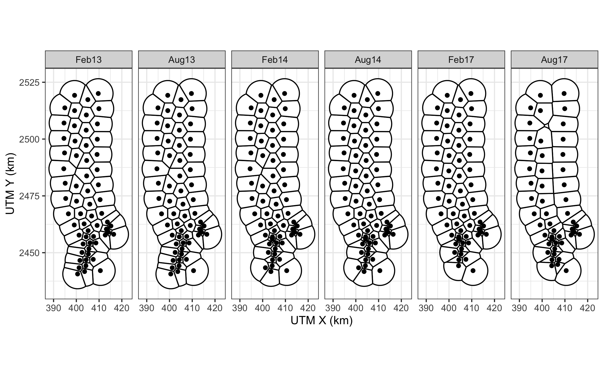
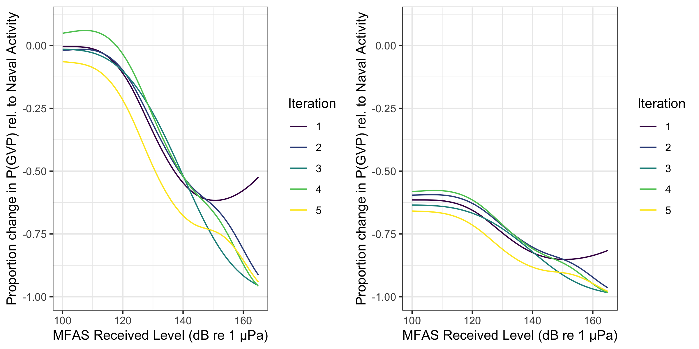

# S2: Supplementary Tables and Figures {.unlisted .unnumbered}


```{r obspdive, fig.cap="Map of observed probability of detecting a group vocal period (GVP) at each hydrophone (color scale) during the baseline period, when naval activity was present, and when mid-frequency active sonar (MFAS) was present (rows) for each submarine commander course (columns).  Note that values of the probability of detecting a GVP are not corrected for effort (size of the hydrophone tile).", out.width='90%', fig.align='center'}
include_graphics("../Figures/SpatialComparisonPDive.png")
```

```{r mfas, fig.cap="Median received level (dB re. 1 $\\mu$Pa) when mid-frequency active sonar was present (color scale) for all hydrophones and submarine commander courses.", out.width='100%', fig.align='center'}
include_graphics("../Figures/AllSCCMedianRL.pdf")
```


```{r boxplot, fig.cap="Boxplot of observed probability of a group vocal period (GVP) for all hydrophones and submarine commander courses (SCCs; vertical axis) during baseline period, when naval activity was present, and when mid-frequency active sonar (MFAS) was present (horizontal axis). Each data point represents one hydrophone during one SCC and one phase of the training exercise.", out.width='60%', fig.align='center'}
include_graphics("../Figures/PDiveBoxplot.png")
```

```{r tessellations, fig.cap = "Pacific Missile Range Facility range tessellations for each of six recorded submarine commander courses.  Black lines indicate boundaries of hydrophone tiles.  Black dots indicate approximate hydrophone locations.", out.width='100%'}

```

```{r m1obspred, fig.cap="Observed (horizontal axis) versus M1 predicted (vertical axis) probability of detecting a group vocal period (GVP) at each hydrophone during the baseline period.", out.width='100%', fig.align='center'}
include_graphics("../Figures/M1ObsPred.png")
```

```{r sdepth, fig.cap="Spline for the relationship between the probability of detecting a group vocal period (GVP) and depth from M1 on the logit-link scale. Solid line: best fit; dashed lines: 95% CIs.", out.width='100%', fig.align='center'}
include_graphics("../Figures/M1SDepth.png")
```

```{r srl, fig.cap="Spline for the relationship between the probability of detecting a group vocal period (GVP) and maximum received level from M3 on the logit-link scale. Solid line: best fit; dashed lines: 95% CIs.", out.width='100%', fig.align='center'}
include_graphics("../Figures/M3SMaxRL.png")
```

```{r iterations, fig.cap = "Example of five iterations (colored lines) of the 5,000 posterior samples of the expected change in the probability of detecting a group vocal period (vertical axis) with increasing mid-frequency active sonar (MFAS) received level (horizontal axis) relative to when naval training activity but no MFAS was present on the range (left panel) and to when neither naval training activity nor MFAS were present on the range.", out.width='100%', fig.align='center'}

```