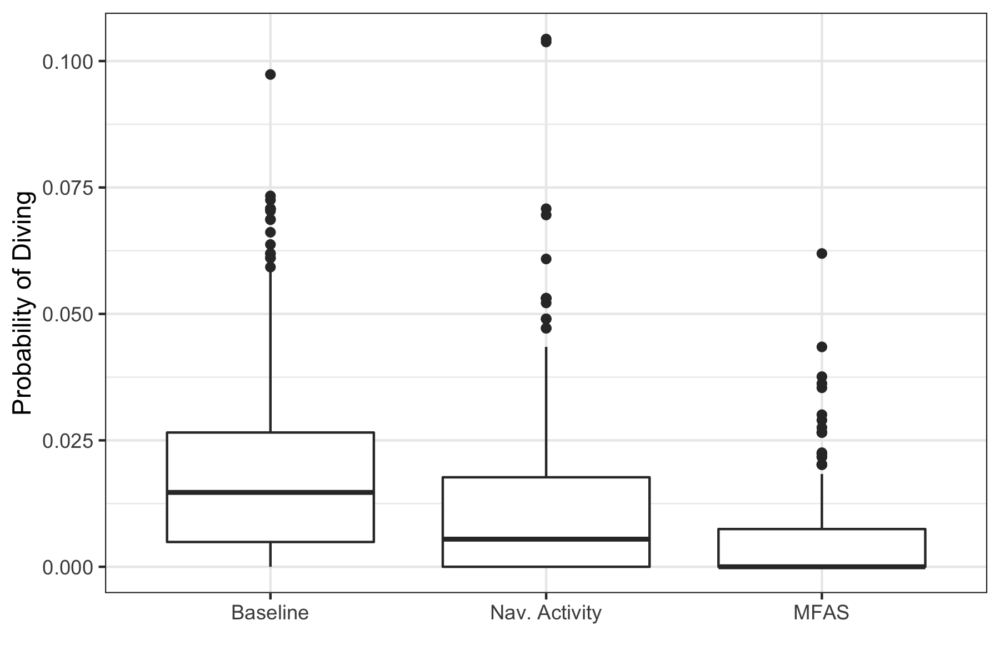
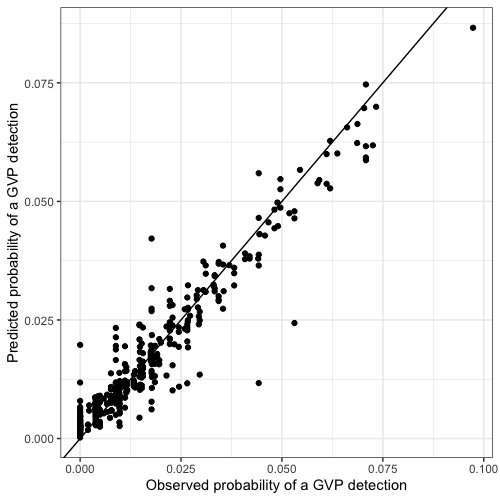
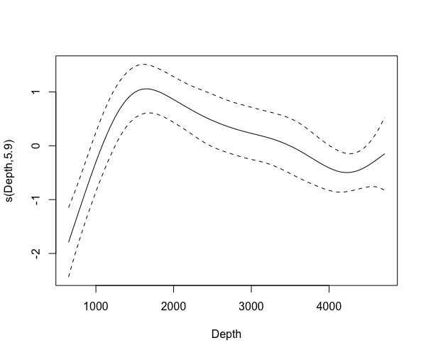
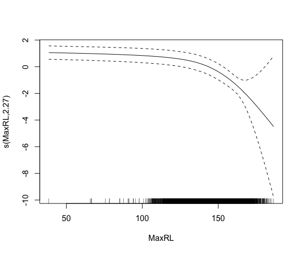

# S2: Supplementary Tables and Figures {.unlisted .unnumbered}


```{r obspdive, fig.cap="Map of observed probability of detecting a GVP at each hydrophone (color scale) during the baseline period, when naval activity was present, and when MFAS was present (rows) for each SCC (columns).  Note that values of the probability of detecting a GVP are not corrected for effort (size of the hydrophone tile).", out.width='90%', fig.align='center'}

```

```{r mfas, fig.cap="Median received level (dB re. 1 $\\mu$Pa) when MFAS was present (color scale) for all hydrophones and SCCs.", out.width='100%', fig.align='center'}
include_graphics("../Figures/AllSCCMedianRL.pdf")
```


```{r boxplot, fig.cap="Boxplot of observed probability of a GVP across all hydrophones and SCCs (vertical axis) during baseline period, when naval activity was present, and when MFAS was present (horizontal axis).", out.width='60%', fig.align='center'}

```

```{r tessellations, fig.cap = "PMRF range tessellations for each of six recorded SCCs.  Black lines indicate boundaries of hydrophone tiles.  Black dots indicate approximate hydrophone locations.", out.width='100%'}

include_graphics("../Figures/SCCTesselations.pdf")

```

```{r m1obspred, fig.cap="Observed (horizontal axis) versus M1 predicted (vertical axis) probability of detecting a GVP at each hydrophone during the baseline period.", out.width='100%', fig.align='center'}

```

```{r sdepth, fig.cap="Spline on depth from M1.", out.width='100%', fig.align='center'}

```

```{r srl, fig.cap="Spline on maximum received level from M3.", out.width='100%', fig.align='center'}

```