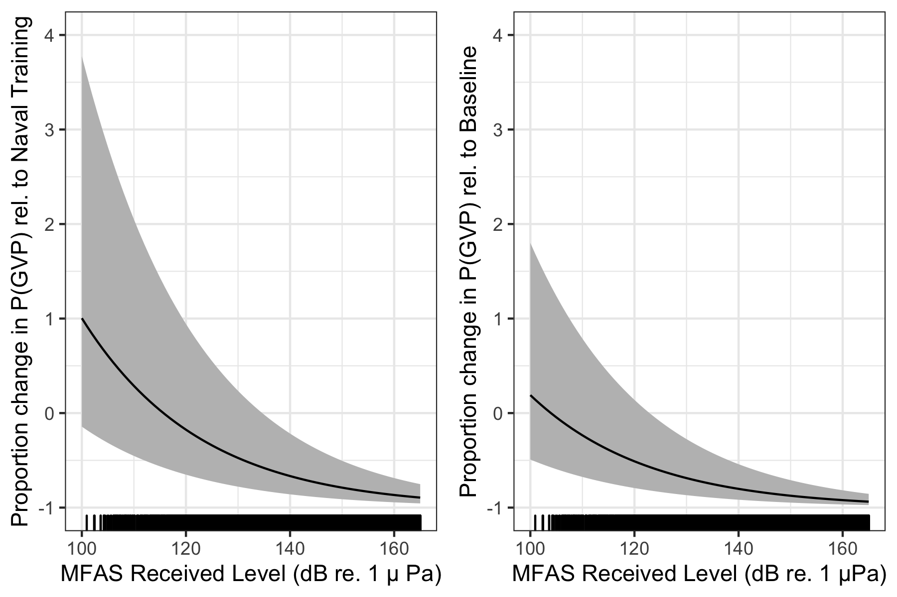

# S3: Single GAM {.unlisted .unnumbered}

A single GAM could be used to quantify the effect of naval sonar on Blainville's beaked whales. Here, we present such a model and compare the results to the results obtained using the multi-stage model presented in the main text of the manuscript.  

We modelled the probability of a GVP at tile $i$ in SCC $s$ at time $t$ as a Bernoulli trial: $\texttt{GVP}_{i,s,t} \sim \text{Bin}(1, \mu_{i,s,t})$. The linear predictor on the logit scale was given as:
\begin{equation*}
    \text{logit}\left(\mu_{i,s,t}\right) = \beta_{0} + \beta_{1}\texttt{NavTrain}_{t} +  f(\texttt{MRF}_{i,s}) + f(\texttt{Depth}_i) + f(\texttt{MaxRL}_i,t)\texttt{Sonar}_{t} + \log_e A_i)
\end{equation*}
where $\beta_{0}$ is an intercept, $\beta_{1}\texttt{NavTrain}_{t}$ is the effect of naval training times an indicator variable for whether naval training was present or absent at time $t$,  $f(\texttt{MRF}_{i,s})$ denotes the Markov random field used to smooth space, $f(\texttt{Depth}_i)$ is a smooth of depth (using a thin plate spline; Wood et al. 2003), $f(\texttt{MaxRL}_{i,t})\texttt{Sonar}_{t}$ is a smooth of sonar received level (using a thin plate spline) times an indicator variable for whether sonar was present or absent at time $t$, and $\log_e A_i$ is an offset for the area (in $\text{km}^2$) of each tile, $A_i$.  

We fit the model to the same data used in \texttt{M1}, \texttt{M2}, and \texttt{M3} (see Methods section of main manuscript for details) using \texttt{mgcv} [@wood_generalized_2017-1].  

This single GAM (Fig. \@ref(fig:m0)) predicts a 41\% (95\% CI 34\%-46\%) decrease in $P(\text{GVP})$ when naval training is present compared to the baseline period, whereas the multi-stage GAM (Fig. 4) predicts a decrease of 44\% (95\% CI 38\%-49\%). The single GAM predicts that at a MFAS received level of 150 dB re 1 $\mu$Pa, $P(\text{GVP})$ decreases by 87\% (95\% CI 71\%-95\%) relative to when only naval training is present, whereas the multi-stage model predicts the same decrease of 87\% with a narrower credible interval (95\% CI 81\%-92\%). Relative to when only naval training is present, the single GAM predicts a 50\% reduction in $P(\text{GVP})$ at a MFAS received level of 120 dB re 1 $\mu$Pa, whereas the multi-stage model predicts a 50\% reduction at a MFAS received level of 132 dB re 1 $\mu$Pa.

The major difference between this single GAM and the multi-stage model presented in the main text of the manuscript is that here, the spatial smooth is constructed using data from the baseline, naval training, and MFAS periods of each SCC.  Therefore, the spatial distribution of MFAS may influence the predicted distribution of Blainville's beaked whales. Using a single GAM leads to similar point estimates of the impact of sonar with greater uncertainty than the multi-stage model. 

```{r m0, fig.cap = "Results from a single GAM: Median (black line) and 95\\% CIs (gray shading) expected change in the probability of detecting a group vocal period (vertical axis) with increasing MFAS received level (horizontal axis) relative to when naval training activity but no MFAS was present on the range (left panel) and to when neither naval training activity nor MFAS were present on the range.", out.width='100%', fig.align='center'}

```
